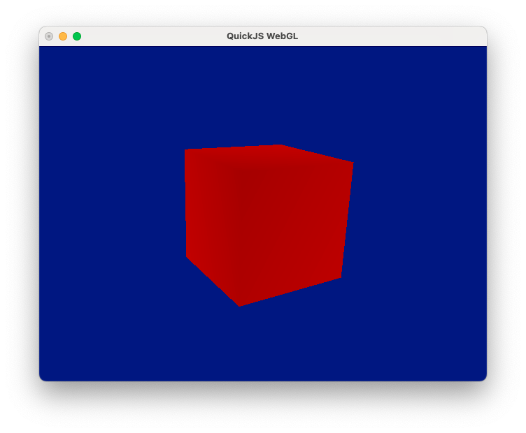

# WebGL bindings for QuickJs (in progress)

This is a simple WebGL bindings for QuickJs. Now it not fully complete and use
GLFW (https://www.glfw.org/) under the hood.

## Getting Started 

    make download - download quickjs distro
    make          - build a shared library
    make test     - run a simple test
    make rawgltf  - run a rotating red cube from a simple glTF model

## Schema

    gl2.h -- (bindgen.js) --> webgl.c \
                                       + -- (cc) --> webgl.so
                          additions.c /
     

## TO DO

    1. Add standard JS polymorphism in places where binary data passed down to GLUT 
       (now only ArrayBuffer supported).
    2. Verify bindings aganist WebGL specification (maybe grab and apply tests somewhere).
    3. Support for loading and display textures
    3. Write docs
    4. Provide Examples

## LICENSE 

    MIT